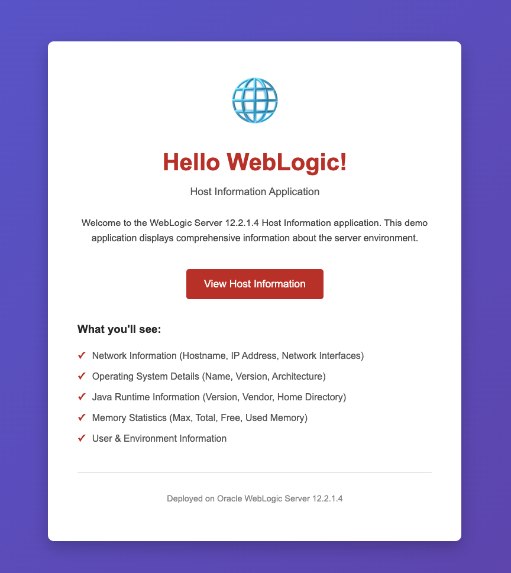
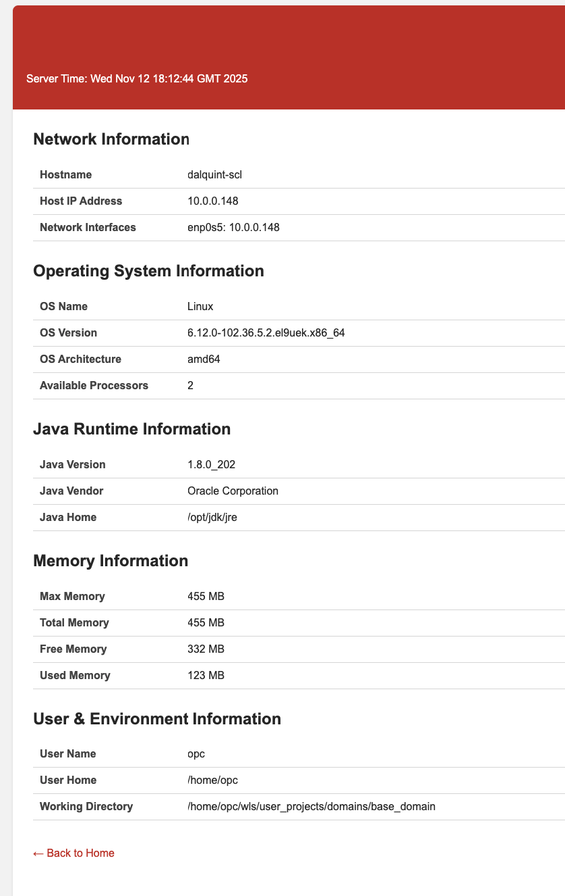

# WebLogic Host Information Application

A Java web application that displays comprehensive host and server information when deployed to Oracle WebLogic Server 12.2.1.4.

## Features

This application displays:
- **Network Information**: Hostname, IP Address, Network Interfaces
- **Operating System Details**: OS Name, Version, Architecture, CPU count
- **Java Runtime Information**: Java Version, Vendor, Home Directory
- **Memory Statistics**: Max, Total, Free, and Used Memory
- **User & Environment Information**: Current user, home directory, working directory

## Project Structure

```
hello-wls/
├── src/
│   └── main/
│       ├── java/
│       │   └── com/
│       │       └── oracle/
│       │           └── demo/
│       │               └── HostInfoServlet.java
│       └── webapp/
│           ├── WEB-INF/
│           │   └── web.xml
│           └── index.html
├── pom.xml
├── build.sh
├── .gitignore
└── README.md
```

## Requirements

- Oracle WebLogic Server 12.2.1.4
- JDK 1.8 or higher
- Apache Maven 3.x

## Building the Application

### Option 1: Using the Build Script (Recommended)

1. Make sure your JAVA_HOME is set:
   ```bash
   export JAVA_HOME=/path/to/jdk1.8.0_202
   ```

2. Run the build script:
   ```bash
   ./build.sh
   ```

### Option 2: Using Maven Directly

1. Ensure JAVA_HOME is set:
   ```bash
   export JAVA_HOME=/path/to/jdk1.8.0_202
   ```

2. Build with Maven:
   ```bash
   mvn clean package
   ```

3. The WAR file will be created at `target/hostinfo.war`

## Deployment Options

### Option 1: WebLogic Admin Console

1. Log in to the WebLogic Admin Console (usually http://localhost:7001/console)
2. Navigate to **Deployments** in the left menu
3. Click **Install**
4. Click **Upload your file(s)** and browse to `target/hostinfo.war`
5. Follow the deployment wizard to complete the deployment

### Option 2: Autodeploy (Development Mode)

For development domains running in development mode:

```bash
cp target/hostinfo.war ${DOMAIN_HOME}/autodeploy/
```

The application will be automatically deployed and started.

### Option 3: WLST (WebLogic Scripting Tool)

```python
connect('username','password','t3://localhost:7001')
deploy('hostinfo', '/path/to/target/hostinfo.war', targets='AdminServer')
```

## Accessing the Application

After deployment, access the application at:

```
http://localhost:7001/hostinfo/
```

Or if deployed to a managed server:

```
http://<server-host>:<server-port>/hostinfo/
```

Click on "View Host Information" to see detailed server environment data.

## URL Mapping

- `/` or `/index.html` - Welcome page
- `/hostinfo` - Host information servlet displaying all server details

## Content

Upon deployment, the application will look like this:   



Later upon clicking button you will see this: 



## Development

To modify the application:

1. Edit the servlet: `src/main/java/com/oracle/demo/HostInfoServlet.java`
2. Edit the welcome page: `src/main/webapp/index.html`
3. Edit the deployment descriptor: `src/main/webapp/WEB-INF/web.xml`
4. Rebuild using `./build.sh`
5. Redeploy to WebLogic Server

## Troubleshooting

- **Maven not found**: Install Maven using `yum install maven` or download from https://maven.apache.org/download.cgi
- **Compilation errors**: Ensure JAVA_HOME is set correctly and points to JDK 1.8+
- **Dependency download issues**: Check your internet connection and Maven repository settings
- **Deployment fails**: Check WebLogic server logs in ${DOMAIN_HOME}/servers/*/logs/

## Maven Commands

- **Clean build**: `mvn clean package`
- **Skip tests**: `mvn clean package -DskipTests`
- **Verbose output**: `mvn clean package -X`
- **Only compile**: `mvn compile`

## License

This is a sample application for demonstration purposes.
