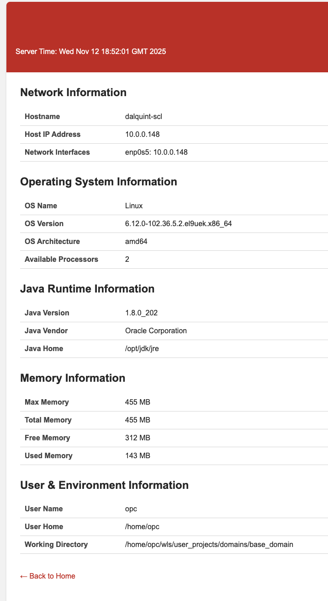
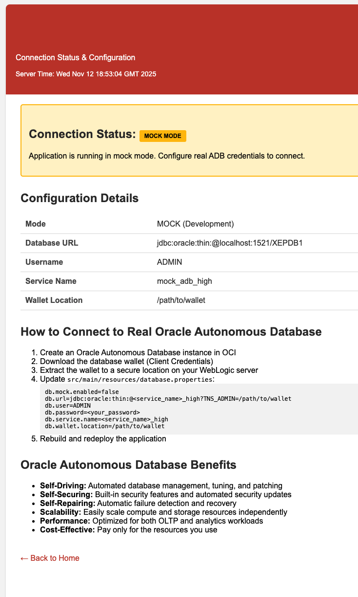

# WebLogic Host Information Application

A Java web application that displays comprehensive host and server information, demonstrates Oracle Autonomous Database connectivity, showcases WebLogic Server session management capabilities, and implements EJB 3.x with JAX-WS web services when deployed to Oracle WebLogic Server 12.2.1.4.

## Features

This application demonstrates:
- **Network Information**: Hostname, IP Address, Network Interfaces
- **Operating System Details**: OS Name, Version, Architecture, CPU count
- **Java Runtime Information**: Java Version, Vendor, Home Directory
- **Memory Statistics**: Max, Total, Free, and Used Memory
- **User & Environment Information**: Current user, home directory, working directory
- **Oracle Autonomous Database Integration**: Connection management, monitoring, and testing
- **Database Connection Pooling**: Using Oracle Universal Connection Pool (UCP)
- **Mock Database Mode**: For development without a real database connection
- **HTTP Session Management**: Session creation, tracking, and state management
- **Session Persistence**: WebLogic-specific session replication and clustering support
- **High Availability**: Session failover in clustered environments
- **Stateless Session Beans**: EJB 3.x with annotation-based configuration
- **JAX-WS Web Services**: SOAP-based web services with automatic WSDL generation
- **Dependency Injection**: Container-managed @EJB injection

## Project Structure

```
hello-wls/
├── src/
│   └── main/
│       ├── java/
│       │   └── com/
│       │       └── oracle/
│       │           └── demo/
│       │               ├── DatabaseConfig.java
│       │               ├── DatabaseConnectionInfo.java
│       │               ├── DatabaseConnectionManager.java
│       │               ├── DatabaseInfoServlet.java
│       │               ├── GreetingServiceBean.java
│       │               ├── HostInfoServlet.java
│       │               ├── SessionInfo.java
│       │               ├── SessionManagerServlet.java
│       │               └── WebServiceDemoServlet.java
│       ├── resources/
│       │   └── database.properties
│       └── webapp/
│           ├── WEB-INF/
│           │   ├── web.xml
│           │   └── weblogic.xml
│           └── index.html
├── pom.xml
├── build.sh
├── .gitignore
└── README.md
```

## Requirements

- Oracle WebLogic Server 12.2.1.4
- JDK 1.8 or higher
- Apache Maven 3.x
- Oracle Autonomous Database (optional - application runs in mock mode without it)

## Building the Application

### Option 1: Using the Build Script (Recommended)

1. Make sure your JAVA_HOME is set:
   ```bash
   export JAVA_HOME=/path/to/jdk1.8.0_202
   ```

2. Run the build script:
   ```bash
   ./build.sh
   ```

### Option 2: Using Maven Directly

1. Ensure JAVA_HOME is set:
   ```bash
   export JAVA_HOME=/path/to/jdk1.8.0_202
   ```

2. Build with Maven:
   ```bash
   mvn clean package
   ```

3. The WAR file will be created at `target/hostinfo.war`

## Deployment Options

### Option 1: WebLogic Admin Console

1. Log in to the WebLogic Admin Console (usually http://localhost:7001/console)
2. Navigate to **Deployments** in the left menu
3. Click **Install**
4. Click **Upload your file(s)** and browse to `target/hostinfo.war`
5. Follow the deployment wizard to complete the deployment

### Option 2: Autodeploy (Development Mode)

For development domains running in development mode:

```bash
cp target/hostinfo.war ${DOMAIN_HOME}/autodeploy/
```

The application will be automatically deployed and started.

### Option 3: WLST (WebLogic Scripting Tool)

```python
connect('username','password','t3://localhost:7001')
deploy('hostinfo', '/path/to/target/hostinfo.war', targets='AdminServer')
```

## Accessing the Application

After deployment, access the application at:

```
http://localhost:7001/hostinfo/
```

Or if deployed to a managed server:

```
http://<server-host>:<server-port>/hostinfo/
```

Click on "View Host Information" to see detailed server environment data.

## URL Mapping

- `/` or `/index.html` - Welcome page
- `/hostinfo` - Host information servlet displaying all server details
- `/database` - Oracle Autonomous Database connection status and information
- `/session` - Session management and tracking demonstration
- `/webservice` - EJB web service demo (interactive UI)
- `/GreetingServiceBean?WSDL` - SOAP web service WSDL endpoint

## Content

Upon deployment, the application will look like this:   


Functionality available will look like this: 






## Development

To modify the application:

1. Edit the servlet: `src/main/java/com/oracle/demo/HostInfoServlet.java`
2. Edit the welcome page: `src/main/webapp/index.html`
3. Edit the deployment descriptor: `src/main/webapp/WEB-INF/web.xml`
4. Rebuild using `./build.sh`
5. Redeploy to WebLogic Server

## Troubleshooting

- **Maven not found**: Install Maven using `yum install maven` or download from https://maven.apache.org/download.cgi
- **Compilation errors**: Ensure JAVA_HOME is set correctly and points to JDK 1.8+
- **Dependency download issues**: Check your internet connection and Maven repository settings
- **Deployment fails**: Check WebLogic server logs in ${DOMAIN_HOME}/servers/*/logs/

## EJB 3.x & JAX-WS Web Services

### Overview

This application includes a stateless session bean that exposes SOAP-based web services, demonstrating:

- EJB 3.x with annotation-based configuration
- JAX-WS (SOAP) web service implementation
- Automatic WSDL generation by WebLogic
- Container-managed dependency injection
- Stateless bean pooling and lifecycle management

### Stateless Session Bean

**GreetingServiceBean** is a stateless EJB annotated with `@Stateless` and `@WebService`:

```java
@Stateless
@WebService(
    name = "GreetingService",
    serviceName = "GreetingService",
    targetNamespace = "http://demo.oracle.com/",
    portName = "GreetingServicePort"
)
public class GreetingServiceBean {
    
    @WebMethod(operationName = "greet")
    public String greet(@WebParam(name = "name") String name) {
        if (name == null || name.trim().isEmpty()) {
            return "Hello, Guest!";
        }
        return "Hello, " + name.trim() + "!";
    }
    
    // Additional methods...
}
```

### Available Web Service Operations

1. **greet(String name)** - Returns a greeting message
   - Input: name (String)
   - Output: "Hello, {name}!"

2. **getWelcomeMessage(String name)** - Returns detailed welcome with timestamp
   - Input: name (String)
   - Output: Greeting message with current date/time

3. **getServiceInfo()** - Returns service information
   - Input: none
   - Output: Service version and description

### Accessing the Web Service

#### Interactive Web UI
Access the interactive demo page:
```
http://localhost:7001/hostinfo/webservice
```

This page allows you to:
- Enter a name and call the `greet()` method
- View real-time EJB invocation results
- See service information and WSDL location
- Test all available operations

#### WSDL Endpoint
After deployment, access the WSDL at:
```
http://localhost:7001/hostinfo/GreetingServiceBean?WSDL
```

Or for remote servers:
```
http://<server-host>:<port>/hostinfo/GreetingServiceBean?WSDL
```

### Testing with SOAP Clients

#### Using SoapUI, Postman, or curl

**Sample SOAP Request** (greet operation):
```xml
<soapenv:Envelope xmlns:soapenv="http://schemas.xmlsoap.org/soap/envelope/" 
                  xmlns:dem="http://demo.oracle.com/">
   <soapenv:Header/>
   <soapenv:Body>
      <dem:greet>
         <name>John</name>
      </dem:greet>
   </soapenv:Body>
</soapenv:Envelope>
```

**Expected SOAP Response**:
```xml
<soap:Envelope xmlns:soap="http://schemas.xmlsoap.org/soap/envelope/">
   <soap:Body>
      <ns2:greetResponse xmlns:ns2="http://demo.oracle.com/">
         <return>Hello, John!</return>
      </ns2:greetResponse>
   </soap:Body>
</soap:Envelope>
```

#### Using curl

```bash
curl -X POST http://localhost:7001/hostinfo/GreetingServiceBean \
  -H "Content-Type: text/xml" \
  -d '<soapenv:Envelope xmlns:soapenv="http://schemas.xmlsoap.org/soap/envelope/" xmlns:dem="http://demo.oracle.com/">
        <soapenv:Header/>
        <soapenv:Body>
           <dem:greet>
              <name>World</name>
           </dem:greet>
        </soapenv:Body>
      </soapenv:Envelope>'
```

### Dependency Injection

The **WebServiceDemoServlet** demonstrates EJB dependency injection:

```java
@EJB
private GreetingServiceBean greetingService;
```

WebLogic automatically:
- Locates the EJB
- Injects the bean instance
- Manages the bean lifecycle
- Handles threading and pooling

### EJB Features Demonstrated

1. **Stateless Session Beans**
   - No conversational state between calls
   - Optimal for stateless operations
   - High scalability through bean pooling

2. **Annotation-Based Configuration**
   - No XML deployment descriptors needed
   - `@Stateless` - Marks the EJB
   - `@WebService` - Exposes as SOAP service
   - `@WebMethod` - Defines service operations
   - `@EJB` - Dependency injection

3. **Container-Managed Services**
   - Automatic transaction management
   - Thread safety
   - Connection pooling
   - Lifecycle management
   - Security integration

4. **JAX-WS Integration**
   - Standards-based SOAP web services
   - Automatic WSDL generation
   - WS-I compliant
   - Interoperable with any SOAP client

### Performance and Scalability

- **Bean Pooling**: WebLogic maintains a pool of bean instances
- **Thread Safety**: Container ensures thread-safe execution
- **Lazy Initialization**: Beans created on-demand
- **Resource Management**: Automatic cleanup and lifecycle management

### Best Practices

1. **Keep Beans Stateless**: Don't store client-specific state
2. **Short-Lived Operations**: Stateless beans are best for quick operations
3. **Exception Handling**: Throw appropriate exceptions for fault handling
4. **Input Validation**: Always validate input parameters
5. **Use Interfaces** (Optional): Can define business interfaces for better separation

### Monitoring and Management

Use WebLogic Console to monitor:
- EJB pool statistics
- Method invocation counts
- Response times
- Active bean instances
- Web service metrics

Navigate to: **Deployments → hostinfo → Monitoring → EJB**

## WebLogic Session Management

### Overview

This application demonstrates WebLogic Server's advanced session management capabilities, including:

- HTTP session creation and tracking
- Session persistence and state management
- Session replication in clustered environments
- High availability and failover support
- Configurable session timeout and cookie settings

### Key Features

#### Session Tracking and Monitoring
- Real-time session statistics (page views, session age, idle time)
- Session attribute management (add, update, remove custom data)
- Session lifecycle monitoring (creation, access, timeout)
- Visual session state display with intuitive UI

#### Session Persistence Types

The application is configured to support multiple persistence strategies via `weblogic.xml`:

1. **In-Memory (Default for Standalone)**
   - Sessions stored in server memory
   - Fast performance, no replication
   - Suitable for single-server development

2. **Replicated (Clustered Environments)**
   - Sessions automatically replicated to secondary servers
   - High availability with automatic failover
   - Primary-secondary replication model
   - Recommended for production clusters

3. **JDBC Persistence (Optional)**
   - Sessions stored in database
   - Survives server restarts
   - Disaster recovery capability
   - Suitable for cross-data center deployments

4. **File Persistence (Optional)**
   - Sessions persisted to file system
   - Server restart recovery
   - Single server deployments

### Configuration Files

#### web.xml Configuration

The `web.xml` file contains standard Java EE session settings:

```xml
<session-config>
    <!-- Session timeout in minutes -->
    <session-timeout>30</session-timeout>
    
    <!-- Cookie configuration -->
    <cookie-config>
        <name>JSESSIONID</name>
        <http-only>true</http-only>
        <secure>false</secure> <!-- Set to true with HTTPS -->
    </cookie-config>
    
    <!-- Session tracking modes -->
    <tracking-mode>COOKIE</tracking-mode>
    <tracking-mode>URL</tracking-mode>
</session-config>
```

#### weblogic.xml Configuration

The `weblogic.xml` file contains WebLogic-specific session settings:

```xml
<session-descriptor>
    <!-- Use replication in clusters, memory otherwise -->
    <persistent-store-type>replicated_if_clustered</persistent-store-type>
    
    <!-- Session timeout in seconds (30 minutes) -->
    <timeout-secs>1800</timeout-secs>
    
    <!-- Session monitoring enabled -->
    <monitoring-attribute-name>session-monitoring</monitoring-attribute-name>
    
    <!-- Cookie settings -->
    <cookie-name>JSESSIONID</cookie-name>
    <cookie-http-only>true</cookie-http-only>
    
    <!-- URL rewriting as fallback -->
    <url-rewriting-enabled>true</url-rewriting-enabled>
    
    <!-- Cache size -->
    <cache-size>1024</cache-size>
</session-descriptor>
```

### Session Replication in Clustered Environments

When deployed to a WebLogic cluster:

1. **Primary Server**: Hosts the active session
2. **Secondary Server**: Maintains replicated session copy
3. **Automatic Failover**: If primary fails, secondary becomes active
4. **Transparent to User**: No session data loss during failover

#### Cluster Setup Requirements

For session replication to work in a cluster:

1. **Create a WebLogic Cluster**:
   - Configure multiple managed servers
   - Add servers to the cluster
   - Set up cluster communication (multicast or unicast)

2. **Deploy to Cluster**:
   - Target the application to the cluster (not individual servers)
   - WebLogic automatically configures replication

3. **Load Balancer Configuration**:
   - Configure sticky sessions (session affinity)
   - Enable session failover
   - Use JSESSIONID for routing

### Session Management Best Practices

1. **Keep Session Data Small**
   - Only store necessary data in sessions
   - Large sessions impact replication performance
   - Use references to external storage when possible

2. **Make Objects Serializable**
   - All session attributes must implement `Serializable`
   - Required for session replication
   - The `SessionInfo` class demonstrates this

3. **Set Appropriate Timeouts**
   - Balance between user experience and resource usage
   - 30 minutes is typical for web applications
   - Adjust based on application requirements

4. **Use HTTP-Only Cookies**
   - Prevents XSS attacks
   - Configured by default in this application
   - Set `secure` flag when using HTTPS

5. **Monitor Session Statistics**
   - Use WebLogic Console to monitor session metrics
   - Track active sessions, timeouts, and replication
   - Adjust cache size based on usage

### Testing Session Management

1. **Access the session page**:
   ```
   http://localhost:7001/hostinfo/session
   ```

2. **Add custom session data**:
   - Enter your name in the "Set User Name" field
   - Add custom key-value pairs
   - Click "Update Session Data"

3. **Monitor session statistics**:
   - View page view count (increments with each visit)
   - Check session age and idle time
   - See remaining time until timeout

4. **Test session persistence**:
   - Add data to the session
   - Close browser (keep session alive)
   - Reopen and access the page
   - Session data should be preserved

5. **Test session invalidation**:
   - Click "Invalidate Session"
   - New session created on next page load
   - All session data cleared

### Clustering and High Availability Demo

To demonstrate session replication and failover:

1. **Set up a WebLogic cluster** with at least 2 managed servers
2. **Deploy the application** to the cluster
3. **Add session data** via the session management page
4. **Note the primary server** hosting your session
5. **Stop the primary server**
6. **Refresh the page** - session data preserved on secondary
7. **Observe seamless failover** with no data loss

### Security Considerations

- **HTTP-Only Cookies**: Prevents JavaScript access to session cookies
- **Secure Flag**: Enable in production with HTTPS
- **Session Timeout**: Automatic cleanup of inactive sessions
- **URL Rewriting**: Disabled by default for better security
- **Session Fixation**: WebLogic regenerates session IDs on authentication

### Performance Tuning

- **Cache Size**: Adjust based on expected concurrent users
- **Replication Mode**: Use async replication for better performance
- **Timeout Values**: Balance between UX and memory usage
- **Monitoring**: Enable JMX monitoring for production systems

## Oracle Autonomous Database Integration

### Overview

This application includes full support for connecting to Oracle Autonomous Database (ADB) in Oracle Cloud Infrastructure (OCI). The application demonstrates:

- Secure database connectivity using Oracle Wallets
- Connection pooling with Oracle Universal Connection Pool (UCP)
- Database connection monitoring and health checks
- Mock mode for development without a real database
- Easy configuration for production deployment

### Running in Mock Mode (Default)

By default, the application runs in **mock mode**, which means:
- No real database connection is required
- The application displays configuration templates
- Perfect for development and testing
- Shows how to configure a real ADB connection

### Connecting to a Real Oracle Autonomous Database

#### Step 1: Create an Autonomous Database in OCI

1. Log in to Oracle Cloud Infrastructure (OCI) Console
2. Navigate to **Autonomous Database** service
3. Click **Create Autonomous Database**
4. Choose your workload type (ATP for transactions, ADW for analytics)
5. Configure your database settings (name, password, etc.)
6. Click **Create Autonomous Database**
7. Wait for the database to provision (usually takes a few minutes)

#### Step 2: Download the Database Wallet

1. In the OCI Console, navigate to your Autonomous Database details page
2. Click **Database Connection**
3. Click **Download Wallet**
4. Provide a wallet password (keep it secure)
5. Download the ZIP file containing the wallet credentials

#### Step 3: Deploy the Wallet to WebLogic Server

1. Copy the wallet ZIP file to your WebLogic server
2. Extract the wallet to a secure location:
   ```bash
   mkdir -p /u01/oracle/wallets/myadb
   unzip Wallet_myadb.zip -d /u01/oracle/wallets/myadb
   chmod -R 700 /u01/oracle/wallets/myadb
   ```

#### Step 4: Configure Database Properties

Edit `src/main/resources/database.properties`:

```properties
# Disable mock mode
db.mock.enabled=false

# Configure your ADB connection
db.url=jdbc:oracle:thin:@myadb_high?TNS_ADMIN=/u01/oracle/wallets/myadb
db.user=ADMIN
db.password=YourADBPassword123!
db.service.name=myadb_high
db.wallet.location=/u01/oracle/wallets/myadb

# Connection pool settings (optional, defaults are provided)
db.pool.initialSize=5
db.pool.minSize=2
db.pool.maxSize=20
```

**Important Notes:**
- Replace `myadb_high` with your actual service name (found in `tnsnames.ora` in the wallet)
- Service names typically end with `_high`, `_medium`, or `_low` (different performance levels)
- Use `_high` for highest performance and parallelism
- Use `_low` for batch operations with serial execution
- Keep the wallet password and database password secure

#### Step 5: Rebuild and Redeploy

1. Rebuild the application:
   ```bash
   mvn clean package
   ```

2. Redeploy to WebLogic Server

3. Access the database page to verify connectivity:
   ```
   http://localhost:7001/hostinfo/database
   ```

### Database Configuration Properties

| Property | Description | Example |
|----------|-------------|---------|
| `db.mock.enabled` | Enable/disable mock mode | `true` or `false` |
| `db.url` | JDBC connection URL | `jdbc:oracle:thin:@myadb_high?TNS_ADMIN=/path/to/wallet` |
| `db.user` | Database username | `ADMIN` |
| `db.password` | Database password | `YourPassword123!` |
| `db.service.name` | ADB service name | `myadb_high` |
| `db.wallet.location` | Wallet directory path | `/u01/oracle/wallets/myadb` |
| `db.pool.initialSize` | Initial pool size | `5` |
| `db.pool.minSize` | Minimum pool size | `2` |
| `db.pool.maxSize` | Maximum pool size | `20` |

### Benefits of Oracle Autonomous Database

- **Self-Driving**: Automated provisioning, tuning, and patching
- **Self-Securing**: Automatic encryption, security updates, and compliance
- **Self-Repairing**: Built-in fault tolerance and automatic recovery
- **Scalability**: Independently scale compute and storage resources
- **Performance**: Optimized for both OLTP and analytics workloads
- **Cost-Effective**: Pay only for resources you consume
- **High Availability**: 99.95% SLA with automatic failover

### Security Best Practices

1. **Wallet Security**:
   - Store wallet files in a secure directory with restricted permissions
   - Never commit wallet files to version control
   - Use environment variables or secure vaults for passwords

2. **Password Management**:
   - Use strong, unique passwords for database accounts
   - Rotate passwords regularly
   - Never hardcode passwords in source code

3. **Network Security**:
   - Use OCI private endpoints when possible
   - Configure access control lists (ACLs) in ADB
   - Enable mTLS (mutual TLS) for enhanced security

### Monitoring and Performance

The application provides:
- Real-time connection pool statistics
- Database connectivity health checks
- Connection success/failure monitoring
- Test queries to verify database responsiveness

Access these features through the database information page at `/database`.

## Maven Commands

- **Clean build**: `mvn clean package`
- **Skip tests**: `mvn clean package -DskipTests`
- **Verbose output**: `mvn clean package -X`
- **Only compile**: `mvn compile`

## License

This is a sample application for demonstration purposes.
